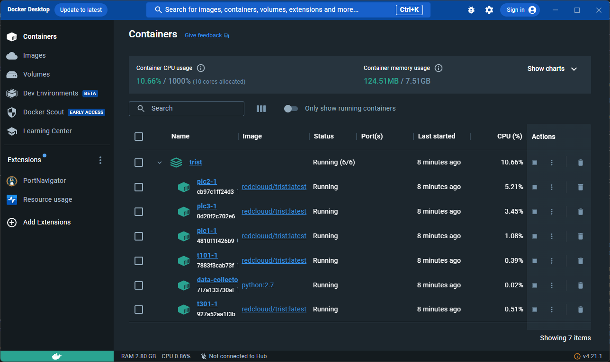
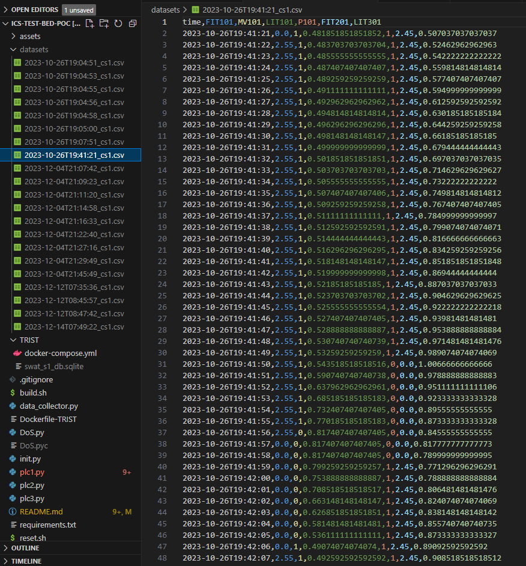
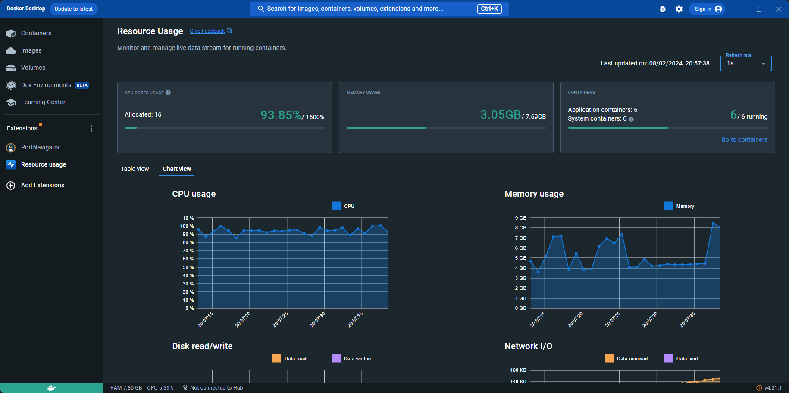

# Aim

Threat Research and Intelligence Sharing Testbed (TRIST) is a virtual testbed aiming to facilitate development and sharing of cybersecurity threat research for Cyber-Physical Systems (CPS). 

# Problems statements

While some researchers have managed to gather data from production environments to study potential threats in CPS processes, the research community often resorts to developing physical testbeds to explore cyber threats. However, such approach can significantly slow down the progress of cybersecurity research for three main reasons. 

- **Confidentiality or Sensitivity Concerns:** Certain datasets cannot be disclosed due to confidentiality or sensitivity concerns.
- **Cost and Time:** Setting up and maintaining physical testbeds is costly and time-consuming.
- **Replication Difficulties:** Fully mimicking the scale of a production environment, particularly when its components are geographically dispersed, is nearly impossible.

These inherent limitations often render cyber security research in ICS unrepeatable and difficult to verify.

# Proposed Methodology

TRIST is inspired by [MiniCPS](https://minicps.readthedocs.io/), a CPS simulation tool that uses [Mininet](http://mininet.org/) for network emulation. TRIST takes one step further by implementing it into a portable and instantly deployable framework by leveraging [Docker containers](https://www.docker.com/), allowing isolation of environments, ensure consistency across systems, and a streamlined deployment process. 

**To start simulating with TRIST, the only prerequisite is having [Docker Desktop](https://www.docker.com/products/docker-desktop/) installed on your Windows / Linux / Mac.** For comparisons between containers and virtual machines such as [VirtualBox](https://www.virtualbox.org/) or [VMWare](https://www.vmware.com/uk.html), please refer to [Docker's documentation](https://www.docker.com/resources/what-container/).

This Github repository is a Proof Of Concept (PoC) to evaluate the usefulness of containerised environments for CPS process simulation. Currently, the goal is to demonstrate how CPS process simulation could be simplified, thereby facilitating the creation of datasets for training and testing machine learning or deep learning applications for cybersecurity purpose. 

To demonstrate the practical application of TRIST, we have used [PyCaret](https://pycaret.org/), an open-source machine learning library in Python, to train unsupervised time series anomaly detection using the datasets created from TRIST. Please dive deeper in the following section on how to generate datasets from TRIST for the development of machine learning model.

# Getting Started

Programmable Logic Controllers (PLCs) are the backbone of industrial automation systems. They are specialized computers that take inputs from sensors, process these inputs according to programmed rules, and then send commands to control actuators like valves and pumps to manage industrial processes efficiently. 

TRIST uses several python scripts to simulate the operations of water supply and storage, including
- PLC1 is the main process that decides how much water should flow through the system, ensuring tanks are neither too full nor too empty.
- PLC2 and PLC3 monitor water flow rate and water level in water tanks, and report back to PLC1 for optimisation. 

Currently, the GitHub repository hosts two primary branches for water supply and storage simulation:
  
- [main](https://github.com/RedClouud/ICS-test-bed-PoC) - this branch simulates the CPS process of water supply and storage in water tanks, typical of water treatment plants, under normal operational conditions. 
   - Raw water is collected from the source and stored into raw water tanks (T101, T301). 
   - This industrial process is controlled by three Programmable Logic Controllers (PLC1, PLC2, PLC3). 
   - To maintain water levels within predefined thresholds, PLCs constantly monitor the water flow sensors (FIT101, FIT201) and water levels in the water tanks (LIT101, LIT301), and then open or close the motorised valve (MV101) and pump (P101) to regulate the water flow and avoid tank overflow.

- [DoS_Emulation](https://github.com/RedClouud/ICS-test-bed-PoC/tree/DoS_Emulation) - this branch introduces an emulated Denial of Service (DoS) attack on master controller (PLC1) to demonstrate the potential impact of a DoS attack on the simulated process. This type of attacks is akin to the Dead Man’s PLC technique, where the adversary has taken full control on the PLCs.

TRIST is continuously evolving, representing a Work In Progress (WIP). Functionality and features may be updated regularly, introducing new capabilities or refining existing ones.

# How to Run CPS Process Simulation for the Creation of Datasets

Follow the steps below to simulate the process of water supply and storage in water tanks:

**1. Clone the repository**

Copy and paste the following command into your terminal:

   ```bash
   git clone https://github.com/RedClouud/ICS-test-bed-PoC.git
   ```

**2. Select the branch**

Copy and paste ***one of the following commands*** into your terminal:

   * For normal operation simulation:
   ```bash
   git checkout main
   ```

   * For Denial-of-Service (DoS) attack emulation:
   ```bash
   git checkout DoS_Emulation
   ```

**3. Create Docker containers for simulation**

Copy and paste the following command into your terminal to create and run Docker containers in detached mode based on the configurations specified in a file called [docker-compose.yml](https://github.com/RedClouud/ICS-test-bed-PoC/blob/main/TRIST/docker-compose.yml), i.e. the Docker containers will run in the background of your terminal and you can continue using your terminal for other commands. 

   ```bash
   cd TRIST
   docker-compose up -d
   ```

After a few moments, you should have six containers running on Docker Desktop, as shown on Figure 1 below:

- plc1-1: PLC1 acts as the master controller, reads sensor data from PLC2 and PLC3 to manage actuators MV101 (open/ close valve) and P101 (start/ stop pump).
- plc2-1: PLC2 monitors flow rate (FIT201) in the second subprocess.
- plc3-1: PLC3 monitors water level (LIT301) in the third subprocess.
- t101-1: water tank (T101) stores raw water with water level indicator LIT101.
- t301-1: water tank (T301) stores raw water with water level indicator LIT301.  
- data-collector-1: create logs and stores as `datasets`

_Figure 1: Docker Desktop displaying all six running containers_


**4. Stop the simulation**

Copy and paste the following command into your terminal to gracefully stop and remove all the Docker containers, along with any networks that were created. This step cleans up the system by stopping and removing unnecessary resources and release space.

   ```bash
   docker-compose down
   ```

**5. Collection of simulated data**

For each started simulation session, the python script data_collector.py begins to collect data generated by each component. Data is recorded in SQLite and exported into a file in CSV format (`.csv`) with the following naming convention: `YYYY-MM-DDThh:mm:ss_cs1.csv`.

To access the generated datasets, navigate to `datasets` directory, as shown in Figure 2 below. However, if you have yet to start simulation, this directory will not yet exist.

_Figure 2: Datasets directory storing simulated data_


The simulated data could be used for developing machine learning experiment. For simplicity, we have used [PyCaret](https://pycaret.org/), an open-source machine learning library in Python, to train unsupervised time series anomaly detection using the datasets created from TRIST. 

**6. Memory consumption**

One of the key benefits of using Docker containers is the lightweight approach on virtualisation. 

You can view the affects of the simulation via the Docker Desktop by using the "Resource usage" extention, as shown in Figure 3 below.

_Figure 3: Docker Desktop displaying memory usage of the testbed_


**7. Reset the environment**

Copy and paste the following command into your terminal to clear any previous state if you ran this simulation in the past, or if you encounter errors during the process. 

* For Unix-based operating systems, such as Linux or Mac:
   ```bash
   chmod +x reset.sh
   ./reset.sh
   ```
* For Windows operating system, you would need to run the above command using Git Bash, WSL (Windows Subsystem for Linux), or another Unix-like terminal.

# Acknowledgments and Contact Us

TRIST is a cybersecurity research project funded by [the Computer Science Research Centre (CSRC)](https://www.uwe.ac.uk/research/centres-and-groups/csrc) of [the University of the West of England](https://www.uwe.ac.uk/).

For inquiries, comments, contributions, or to propose new features, please feel free to [open an issue on our GitHub repository](https://github.com/RedClouud/ICS-test-bed-PoC/issues) or email us at contact dot q65xp at slmail dot me for more direct communication.